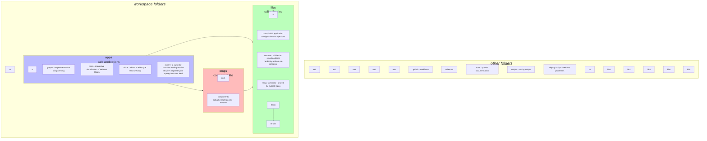

# TheriousLab

A modest monorepo

```mermaid
graph TD;
    subgraph other[other folders]
        aa1:::hidden~~~aa2:::hidden~~~aa3:::hidden~~~aa4:::hidden~~~
        aaa:::hidden~~~.github[.github - workflows]~~~schemas~~~docs[docs - project documentation]~~~scripts[scripts - sundry scripts]~~~deploy-scripts[deploy-scripts - release processes]~~~zz:::hidden
    ~~~bb1:::hidden~~~bb2:::hidden~~~bb3:::hidden~~~bb4:::hidden~~~bb5:::hidden
    end
    
subgraph workspace[workspace folders]
     w:::hidden~~~apps
        
    subgraph apps["`**apps**
        web applications`"]
        a:::hidden
        graphic[graphic - experiments with diagramming]
        roots[roots - interactive visualization of Hebrew Roots] 
        ticket[ticket - Ticket to Ride type react webapp]
        zclient[zclient - a currently unstable trading monitor\nrequires separate java spring boot oms feed]
    end
    subgraph cmps["`**cmps**
    component libs`"]
        direction TB
        components[components\n actually react specific -- rename]
        ccc1:::hidden~~~components
    end
    
    subgraph libs["`**libs**
    utility libraries`"]
        direction TB

        boot[boot - initial application configuration and injections]
        redux-std-slices[redux-std-slices - shared by multiple apps]
        random[random - utilities for selecting items\nrandomly and not-so-randomly]
        fizbin
        th-utils
        lll:::hidden~~~boot~~~random~~~redux-std-slices~~~fizbin
    end
    
    
end
    workspace:::ws
    other:::ws   
    apps:::app & cmps:::cmp -->libs:::lib
    apps --> cmps
    fizbin-->th-utils
classDef ws font-size:24pt,font-style:italic

classDef app fill:#bbf,font-size:18pt
classDef cmp fill:#fbb,font-size:18pt
classDef lib fill:#bfb,font-size:18pt

```
